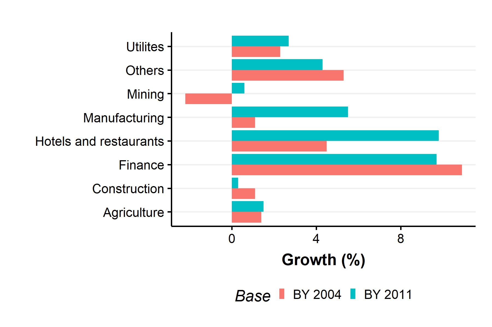
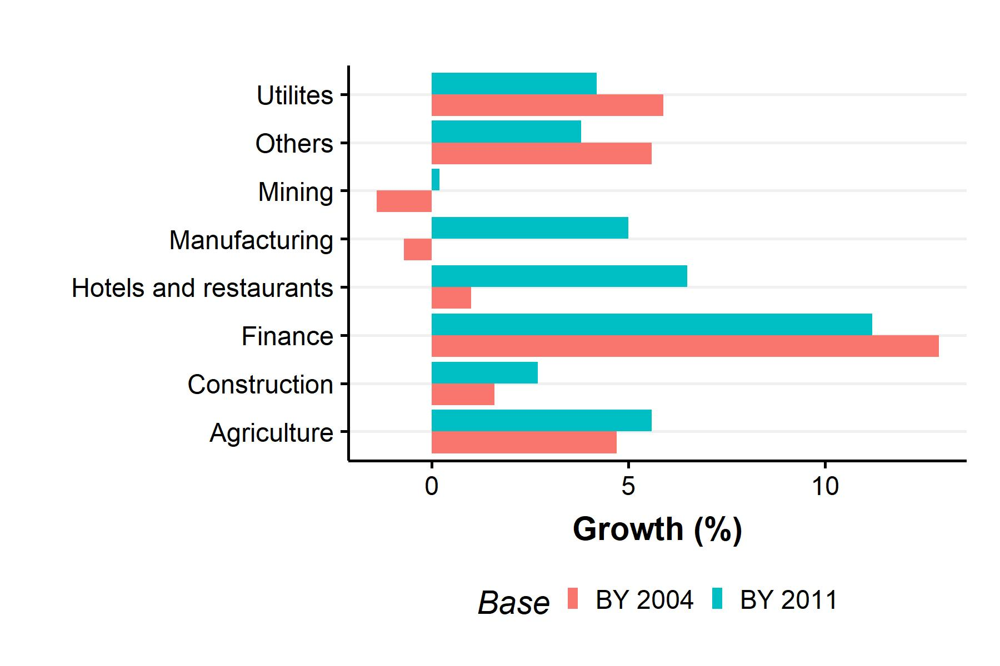

---
header-includes:
    - \usepackage{setspace}\onehalfspacing
    - \usepackage{amsmath}
    - \usepackage{amssymb} 
---

```{r include_packages_77, include = FALSE}
# This chunk ensures that the thesisdown package is
# installed and loaded. This thesisdown package includes
# the template files for the thesis and also two functions
# used for labeling and referencing
if (!require(remotes)) {
  if (params$`Install needed packages for {thesisdown}`) {
    install.packages("remotes", repos = "https://cran.rstudio.com")
  } else {
    stop(
      paste(
        'You need to run install.packages("remotes")',
        "first in the Console."
      )
    )
  }
}
if (!require(dplyr)) {
  if (params$`Install needed packages for {thesisdown}`) {
    install.packages("dplyr", repos = "https://cran.rstudio.com")
  } else {
    stop(
      paste(
        'You need to run install.packages("dplyr")',
        "first in the Console."
      )
    )
  }
}
if (!require(ggplot2)) {
  if (params$`Install needed packages for {thesisdown}`) {
    install.packages("ggplot2", repos = "https://cran.rstudio.com")
  } else {
    stop(
      paste(
        'You need to run install.packages("ggplot2")',
        "first in the Console."
      )
    )
  }
}
if (!require(bookdown)) {
  if (params$`Install needed packages for {thesisdown}`) {
    install.packages("bookdown", repos = "https://cran.rstudio.com")
  } else {
    stop(
      paste(
        'You need to run install.packages("bookdown")',
        "first in the Console."
      )
    )
  }
}
if (!require(thesisdown)) {
  if (params$`Install needed packages for {thesisdown}`) {
    remotes::install_github("ismayc/thesisdown")
  } else {
    stop(
      paste(
        "You need to run",
        'remotes::install_github("ismayc/thesisdown")',
        "first in the Console."
      )
    )
  }
}
library(thesisdown)
library(dplyr)
library(ggplot2)
library(knitr)
library(tidyselect)

```
# GDP Measurement in India and the World {#ch1}

Economic growth and its determinants are a key area of macroeconomic research. The question of achieving sustained and inclusive growth is the cornerstone of economic policy for most developing countries. Statistical measurement of GDP and related macroeconomic aggregates  to identify the sectors of the economy that are performing well and those that are stagnating is crucial. Consequently, the measurement of GDP and related magnitudes are an object of scrutiny from academia, media and policymakers.
\linebreak

However, India's GDP numbers have been scrutinized even more than usual, especially over the last decade. Commentators have identified several issues in the data post-2011, the major ones listed as follows. One, the assumption that the informal and formal sectors grow at the same rates has led to an overestimation bias in the output of the manufacturing sector. Recent research has found a significant difference in manufacturing output as computed by formal and informal sector surveys [@bhattacharya_great_2019]. Two, inappropriate deflators have been applied to nominal GDP data, and applying the right deflators leads to significant differences in output estimates. Finally, the focal point of debate has centred on the use of a new database, called the MCA21 database. Critics have pointed out that along with other issues like firm misclassification and lack of state-level data, the assumption that non-reporting firms contribute positively to growth has led to a "blowing up" of manufacturing output.
\linebreak

The third issue has caused many to question the veracity of GDP estimates in recent years. This, along with the lack of good quality data alternatives raise an important question - is India's GDP overestimated, and if so, by how much? In this thesis, I attempt to tackle this question. This chapter sets the context for the empirical exercise implemented in Chapter-[3](#ch3), by first providing a historical overview of GDP and national accounting (Section [1.1](#his)). The rest of the chapter is structured as follows. Section [1.2](#met), discusses the three methods of GDP measurement - namely the production, income and expenditure methods. In Section [1.3](#deb), I present the Indian GDP debate, focussing on two major critiques: one, the exchange between economist R. Nagaraj and the Central Statistical Organization on the veracity of the real GDP series with the base year 2011, and two, the concerns raised by Arvind Subramanian, the former Chief Economic Advisor on the recent growth numbers, and their changing relationship with key correlates of GDP. Section [1.4](#ccn) concludes.

## National Accounting: A Brief History{#his}

The Gross Domestic Product (GDP) is one of many figures published in national account statistics across the world^[Others include Gross National, Net Domestic and Net National Product respectively.]. The System of National Accounts (SNA), defines it as 

\begin{quote}
the sum of the gross value added of all the institutional units resident in a territory engaged in production (that is, gross value added at basic prices) plus any taxes, minus any subsidies, on products not included in the value of their 
outputs.
\end{quote}

This is an almost universally accepted definition of GDP. However, such precise definitions of output aggregates are a recent phenomenon, with the first edition of the SNA only appearing in the mid-20th century. The origins of national accounting can be traced back to British official William Petty, who first produced estimates of income, expenditure and population in the 17th century to show that England had sufficient resources to raise taxes and take on its neighbours in the Anglo-Dutch war. In this period, warfare was the key motivation for estimating national output, with estimates prioritizing different goals for prosperity, ranging from increasing trade to reducing domestic government debt [@coyle_gdp_2014]. An innovation in establishing a stable benchmark for what constitutes national income came in form of Adam Smith's *Wealth of Nations*, which stressed the difference between productive and unproductive work [@smith_wealth_2000]. Smith stressed that only labour that adds tangible value is productive, and this net the national debt was the national income. In this definition, services were unproductive and subtracted from the total output.
\linebreak

Modern national income accounting was born as a consequence of the Great Depression and the Second World War. Colin Clark in the UK and Simon Kuznets in the US worked on providing income estimates for their respective countries. Kuznets's estimates of output during the Great Depression period were crucial to justifying the subsequent recovery plan [@kuznets_national_1934]. During this time, there was a clash of ideas about whether government spending should be included in national income accounting. Kuznets argued for its exclusion, saying that active fiscal spending increased growth independent of individual welfare. This was abandoned in favour of the inclusion of government spending as many economists and government officials argued for its necessity in expanding output during wartime [@keynes_how_2010]. The Second World War was crucial in cementing the notion of government spending as adding to rather than subtracting from production. More importantly, national output explicitly became an indicator of prosperity and not welfare.
\linebreak

The first two decades of the post-war era, characterized as the Golden Age was characterized by rapid growth and low inflation and unemployment in the United States and Europe. National account statistics began to be standardized, and the United Nations established the SNA in 1953. The ideas of demand management and the importance of public spending in ensuring full employment outlined in Keynes' General Theory [@keynes_general_2016] centralized the notion that government can control output. This period also saw the Cold War emerge between the US and the Soviet Union, and led to the development of exchange rate and purchasing power parity (PPP) adjusted GDP to make international comparisons. The notion of GDP as an end in itself was challenged due to the crises of the 1970s like stagflation, and the critiques offered by movements like environmentalism [@schumacher_small_1993]. This led to the creation of alternative measures of development like the Human Development Index (HDI).
\linebreak

The next two decades were marked by a shift in the understanding of the causes of growth: fiscal policy receded into the background, while monetary policy and price stability took centre - stage. Growth theory endogenized technology, and human capital, arguing that innovation and R&D create a virtuous cycle [@romer_increasing_1986;@romer_endogenous_1990]. The key challenge during this period was the measurement of services: with the GDP largely originating from the need to estimate the material constraints of the economy, measuring the value of services, especially public services proved to be difficult as inputs are difficult to quantify. With explosion and innovation and variety, GDP also fell short in accounting for rapid changes in prices and improvements in quality. This led the Boskin Commission in the US to conclude that inflation was overstated and growth understated by an average of 1.3% points [@oulton_implications_1998]. This paved the way to the usage of hedonic price indices, which uses qualitative characteristics of products to explain their prices. Secondly, software purchases were now not seen as intermediate goods, but as investments due to their role in enhancing productivity. While controversial, both these methodological changes shaped GDP measurement significantly in this period.
\linebreak

The 2008 financial crisis led to questions about the role of financial services in GDP, as the output share of the sector remained high despite large-scale bankruptcies during this period. Contributions of this sector are measured in a fuzzy manner - in proportion to risks that banks and institutions take relative to their outstanding balances, leasing studies to conclude that the sectoral output may be overstated from anywhere between one-half to one-fifth [@haldane_what_2011]. Another emerging concern was the limitations of GDP in incorporating the role of the informal or so-called shadow economy, due to the arbitrary nature of what is measured and what is not. This has changed in recent times, with the use of time-use surveys and other calibrations to incorporate this aspect into GDP calculations. 
\linebreak


Finally, studies on the link between prosperity and happiness, as well as challenges like climate change have led to the emergence of movements pushing for expansion of GDP to incorporate sustainability and other aspects of well-being [@easterlin_happinessincome_2010]. While the debate is shifting in many advanced companies, the primacy of growth in lifting people out of poverty in developing countries, as well as helping reduce inequality [@milanovic_global_2013] means that GDP will continue to remain a centrepiece of economic discourse in the years to come.


## GDP Measurement: Methodologies{#meth}

In this section, I briefly describe the three common approaches used to estimate the GDP of a nation, namely the Production or Output method, the Expenditure method, and the Income method. Since these are accounting frameworks, the estimates generated by all three methods are equal by definition. However, data requirements vary for each method, as the next few paragraphs will make clear. 

### Production/Output Method

The production output, following its name, simply adds up the value of all goods and services produced in the economy. This requires estimating gross sales that have taken place over a given period (say a quarter, or a year), and then subtracting the value of the goods used to produce these, also called "intermediate goods" , to avoid the problem of double counting. 

\begin{equation}
\text{GDP(O)}= \text{Value of output (less change in inventories)} - \text{Intermediate goods}
\end{equation}

The tracking of intermediate and final goods is often tricky; the development of the input-output method by economist Wassily Leontief formalized the production method systematically, allowing the tracking of the goods going into production and the value of the final output. This method became attractive to estimate GDP in planning-based economies and was widely adopted in the USSR [@tretyakova_input-output_1976].

### Income Method

The income method looks at the economy from a different point of view and measures the GDP as the sum of incomes earned. All output in the economy yields income from the various factors of production. The first component is the compensation of employees (COE), consisting of wages earned in cash and kind by workers employed, as well as any kind of benefits provided by employers, like social security or a provident fund. The second component includes income earned on property, and income earned from entrepreneurship. The former consists of rent and interest, while the latter consists of profits and dividends. Together, these constitute the Operating Surplus (OS). Finally, there is income earned by "own-account" production, consisting of self-employed workers and unincorporated enterprises, whose incomes do not fit into any of the neat categories defined above. This is called Mixed Income (MI). Adding these up, we get:

\begin{equation}
\text{GDP(I)= \text{COE}+\text{OS}+\text{MI}}
\end{equation}

Statistics for GDP using the income method are usually available only for advanced economies with well-developed statistical departments like the US. This is because estimating incomes requires regular and meticulous data from household surveys, which are often not regularly conducted in developing countries. The income approach serves as a valuable alternative source to validate estimates from other approaches, as detailed further in Chapter - [3](#ch3).

### Expenditure Method

The expenditure approach looks at the economy from the exact opposite vantage point as the production method. While the latter looks backward from a point of view of finished output, the former looks at all the input costs going into the economy, or the sum of expenditures. There are four components estimated in this approach. The first is Consumption (C), consisting of all expenditure by private consumers on goods and services. The second is Investment (I), which is the sum of all capital expenditure undertaken domestically by the private sector. The third component is Government (G), which includes both consumption expenditure and investment undertaken by the government, while the last component is net exports (X-M), which is the difference between money spent by foreigners on domestic goods, and domestic consumers on foreign goods and services. Together, we have

\begin{equation}
\text{GDP(E)}=\text{C+I+G+(X-M)}
\end{equation}

This approach is one of the most commonly used to estimate GDP. Increases and shortfalls in spending serve as a clear and precise way of communicating fluctuations in the economy, leading to this framework used often to explain the impact of policy on output. For example, the effect of fiscal stimulus (increase in G) on GDP during recessions is an oft-debated topic.
\linebreak

In India, GDP is estimated using the production and expenditure method. The former estimates gross value added (GVA) by eight sectors of the economy ^[These are  Agriculture and Allied Sectors, Mining, Manufacturing, Electricity and Utilities, Construction, Trade, Restaurants and Transport, Finance and Real Estate, and Public Administration and Defense.]. The expenditure method uses the format described previously. However, there is little to no data estimated using the income method, due to the lack of regular survey data on household incomes.
\linebreak

With this brief overview of the history and measurement of GDP in mind, I now present the debate on the measurement of India's real GDP in the next section.

## The Indian GDP Debate{#deb}

India's Central Statistics Office (CSO) is the agency responsible for publishing estimates of GDP since 1950. Following best practices, the CSO also undertakes revisions of the base year used to measure GDP with constant prices. Updating the base year is a routine practice and typically does not affect the sectoral as well as the aggregate growth trend. However, the set of national account statistics published after changing the base year from 2004 to 2011 has been subject to much scrutiny [@sapre_analysis_2017;@nair_base_2019]. In this section, I discuss two major critiques: one regarding the methodology of measuring manufacturing output, while the other tackling the shift in the relationship between the new GDP numbers and some correlates.

### The Nagaraj - CSO Debate

The change in the methodology for measuring manufacturing output in the new real GDP series (base 2011) prompted an exchange between R Nagaraj, an economist at the Indira Gandhi Institute of Development Research (IGIDIR) and the CSO, in the pages of the *Economic and Political Weekly*, the details of which I summarize below.
\linebreak

Nagaraj begins by pointing out that there is a significant difference in growth rates for the real GDP as estimated using the 2011 and 2004 series, at  6.6% and 4.7% respectively [@nagaraj_seeds_2015-1]. The primary difference between the old and new series is driven by changes in measures of gross value added, savings and investment due to a change in the database used by the CSO. The new database, called MCA21 has been argued to be better as it contains firm returns filed with the Ministry of Corporate Affairs and has a much larger sample size. The veracity of the new series is questionable, however, due to differences in estimates reported by the Sub-Committee on Private Corporate Sector in its 2014 provisional report and the 2015 final report. PCS savings, investment and GVA shot up by 257\%, 34\% and 108\% respectively between the old and news reports. This combined with the fact that the MCA21 is not publicly available, and that the estimates were not vetted independently was a cause of great concern. Nagaraj stresses that caution must be exercised as the previous database used to measure manufacturing GVA suffered from poor response rates and insufficient filing data. This is supplemented by using a "blow-up" factor to compute the aggregates in proportion to the paid-up capital. Citing previous work, Nagaraj argues that relative to alternative sources, there has been a significant overestimation in the GVA numbers.
\linebreak

In its reply [@cso_no_2015], the CSO argues that concerns regarding the veracity of PCS output are misplaced. It begins by pointing out that the draft report cited by Nagaraj was a work in progress, and incomplete in many ways. The output in the draft report was restricted to the total revenue reported by the filing companies. However, in the final report the CSO felt that using data from individual components determining the revenue shows the complete picture better; hence the re-estimation and difference in final numbers. It also argues that the scaling-up factor was justified, as there is a deadline for companies to file returns with the database, and incomplete returns were accounted for using this method. Furthermore, paid-up capital for companies who were active but not filed was used to scale up, as no other parameter was available. The other reasons pertained to changes in definitions, usage of individual components of revenue instead of total revenue, and usage of better quality data. Finally, some reclassification and adjustments done to comply with SNA 2008 contributed to the gap between the two figures. Hence, the CSO argues that there is no reason to doubt the veracity of estimates post - 2011.
\linebreak

In his rejoinder [@nagaraj_seeds_2015], questions the usage of dis-aggregated revenue data instead of aggregate data, and argues that the drastic difference in estimates indicates a lack of consistency in the MCA21 database. The main critique centres on the usage of the 'scaling-up' factor: as the number of companies sampled was lower in 2013-14 than the previous year, the scaling-up factor is larger, causing overestimation. He further argues that the problem of PCS estimation precedes this procedure, as very few firms with large output are legally registered, already causing the PCS to skew upwards.

```{r nag1, echo=FALSE, fig.align="center",out.width="100%", fig.cap="Disaggregated GDP growth rates by sector (2012-13). Source: Nagaraj (2015b)."}

```

```{r nag2, echo=FALSE, fig.align="center",out.width="100%", fig.cap="Disaggregated GDP growth rates by sector (2013-14). Source: Nagaraj (2015b)."}

```

Figures \@ref(fig:nag1) and \@ref(fig:nag2) show the disaggregated growth rates for gross value added by various sectors of the economy, using the 2004 and 2011 base years. Both figures are taken from Nagaraj's rejoinder. As mentioned before, while the change in base year leads to changes in levels, growth trends remain largely smooth. This principle holds broadly for most sectors in both figures, except for Hotels and Restaurants and Manufacturing. The growth numbers as estimated using the 2011 base are significantly larger than those with the old base. For the former, this could be explained due to the reclassification of many sectors to the Trade category, of which Hotels and Restaurants are a subset. However, for the latter, the gap is a cause of concern according to Nagaraj, as the only methodological change pertains to the usage of a new database, and the continued usage of the blowing up factor to account for incomplete data. Especially, for the years 2013-14, the direction of the trends are in opposite directions, with the old base estimating negative growth. Nagaraj concludes that "seeds of doubt" regarding the accuracy of the GDP figures, especially the growth rates of PCS GVA remain.
\linebreak

In a recent summary [@nagaraj_revisiting_2021], Nagaraj reiterates these concerns and argues that PCS output remains overestimated. The Nagaraj- CSO debate shows that measurement of manufacturing area output is an area of concern. Other technical issues with the new series are detailed in @nagaraj_measuring_2016.

### Subramanian's Cross-Country Approach

Arvind Subramanian, India's former Chief Economic Advisor makes the case that India's GDP is overestimated using a different methodology [@subramanian_indias_2019]. As a 'smell test', he compiles a list of 17 indicators strongly correlated with GDP growth (electricity consumption, vehicle sales, real credit etc.), and finds that pre-2011, 16 of these are positively correlated with GDP growth, but post - 2011, 11 indicators correlate *negatively*. Given that average growth rates in both periods are similar, this is a concerning finding.
\linebreak


To further test this proposition, Subramanian runs two sets of regressions: first, a cross-sectional specification which regresses GDP growth on electricity, credit, export and import growth, along with their interactions with a time dummy $T$, which accounts for tehe time periods before and after 2011, as well as an India dummy and its interaction with $T$. The second is a panel specification, regressing the same variables, but with log levels, along with unit and time fixed effects. The coefficient of interest was that of India time dummy interaction which tells if India's GDP was overestimated post-2011 relative to pre-2011. The specification in essence follows a difference-in-difference structure, using a sample of more than 80 low and middle-income countries. 
\linebreak

The idea is to identify a sample of countries which have a robust correlation between growth and some select indicators, and check if India's growth numbers fall into this broad pattern or not. Subramanian finds that the India time dummy interaction coefficient is statistically insignificant pre-2011 and significant post-2011 at 1% levels, indicating that India is an outlier and that there is an overestimation of output relative to the pre-2011 period. Using these results, Subramanian argues that there is a 2.5\% overestimation in India's GDP annually from 2011-2016. Subramanian's explanation for these results, much like Nagaraj's centres on changes in manufacturing output measurement, particularly the shift from volume-based to value-based measurement. He concludes by calling for a re-examination of National Income Accounting, and transparency in government statistics. 

## Conclusion{#ccn}

In this chapter, I provided a broad overview of the history of national income accounting worldwide, as well as different methods used to measure GDP. Following this, I explored two critiques of real GDP measurement in India in recent times. These studies are a cause for concern as accurate measurement of GDP is crucial to economic policymaking in India. Maximizing growth continues to be a cornerstone of developmental policy, with India and China emerging as two of the fastest-growing economies in the 21st century, even as advanced economies are experiencing stable but stagnant growth.
\linebreak

Estimating measurement error precisely requires good quality data from alternate sources, which I detail further in Chapter - 3. The lack of data from the income - side makes this difficult to estimate for countries like India. Hence, I take a different approach, using the synthetic control method (SCM) to estimate a counterfactual GDP using data from countries similar to India, which did not implement a methodological change in 2011. Chapter-[2](#ch2) goes into the details of the SCM, while Chapter-[3](#ch3) uses the SCM to estimate measurement error in Indian GDP.


