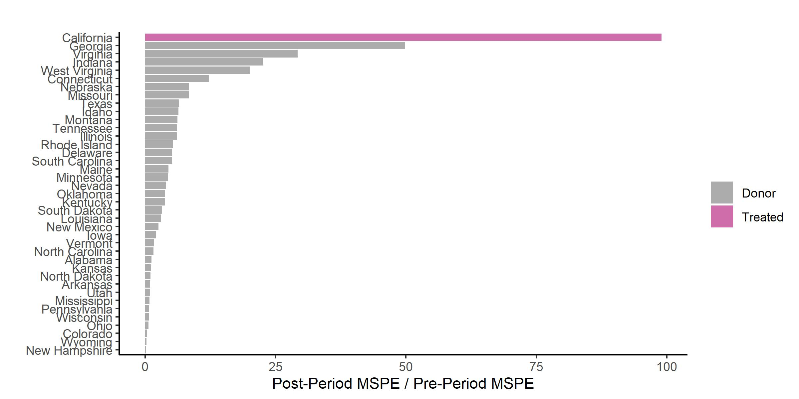

```{r include_packages_9, include = FALSE}
# This chunk ensures that the thesisdown package is
# installed and loaded. This thesisdown package includes
# the template files for the thesis and also two functions
# used for labeling and referencing
if (!require(remotes)) {
  if (params$`Install needed packages for {thesisdown}`) {
    install.packages("remotes", repos = "https://cran.rstudio.com")
  } else {
    stop(
      paste(
        'You need to run install.packages("remotes")',
        "first in the Console."
      )
    )
  }
}
if (!require(dplyr)) {
  if (params$`Install needed packages for {thesisdown}`) {
    install.packages("dplyr", repos = "https://cran.rstudio.com")
  } else {
    stop(
      paste(
        'You need to run install.packages("dplyr")',
        "first in the Console."
      )
    )
  }
}
if (!require(ggplot2)) {
  if (params$`Install needed packages for {thesisdown}`) {
    install.packages("ggplot2", repos = "https://cran.rstudio.com")
  } else {
    stop(
      paste(
        'You need to run install.packages("ggplot2")',
        "first in the Console."
      )
    )
  }
}
if (!require(bookdown)) {
  if (params$`Install needed packages for {thesisdown}`) {
    install.packages("bookdown", repos = "https://cran.rstudio.com")
  } else {
    stop(
      paste(
        'You need to run install.packages("bookdown")',
        "first in the Console."
      )
    )
  }
}
if (!require(thesisdown)) {
  if (params$`Install needed packages for {thesisdown}`) {
    remotes::install_github("ismayc/thesisdown")
  } else {
    stop(
      paste(
        "You need to run",
        'remotes::install_github("ismayc/thesisdown")',
        "first in the Console."
      )
    )
  }
}
library(thesisdown)
library(dplyr)
library(ggplot2)
library(knitr)
library(tidyselect)

```


# The Synthetic Control Method

The synthetic control method is a relatively recent innovation in causal inference. It was first introduced by Alberto Abadie and Javier Gardeabazal in their 2003 paper investigating estimating the impact of conflict on GDP in the Baque county [@abadie_economic_2003]. Since then, the method has been used widely to study the impact of policy interventions involving large economic units like cities, states or countries [@abadie_synthetic_2010; @abadie_comparative_2015]. Nobel laureate Guido Imbens and Susan Athey call it "arguably the most important innovation in the policy evaluation literature in the last 15 years" in a recent review of applied econometrics [@athey_state_2017].
\linebreak

In this chapter, I present an overview of the synthetic control method (SCM), beginning with a non-technical introduction. In Section 2.2, I examine the theory behind the method, focussing on the setup, estimation and inference. In Section 2.3, I present the advantages and limitations of the SCM. I review the advances in the literature on alternative estimation methods in Section 2.4. In Section 2.5 I delve deeper into the mechanics of the generalized synthetic control methods (GSCM) and conclude in the last sectiomn 

## Introduction 

Synthetic control methods emerged in the context of comparative case studies. Case studies often study the effect of a policy or intervention on a particular outcome, by comparing it to other determinants of the outcome. For example, a medicine case study focuses on an ailment, while a political case study examines the impact of an electoral strategy. Comparative case studies compare one or more units exposed to the event or intervention of interest to one or more unexposed units. For example, @abadie_synthetic_2010 examines the impact of Proposition 99, a tobacco control program implemented in California and compares its impact on cigarette sales relative to other states. Only some units must be exposed to the intervention, while other comparable units are not.
\linebreak

Comparative case studies have been used in economics for a long time. However, studies typically relied on the comparison between one unit where a policy was implemented (also called 'treatment' unit) to a similar unit, where the policy did not take place (also called 'control' unit). A classic example is the study by @card_impact_1990. Card examines the impact of the Mariel boatlift, which bought Cuban workers to Miami on the wages of low-skilled workers. He considers various single 'control' cities like Houston or Philadelphia, where no such event took place to estimate the difference between wages. The key assumption here is that wages in Miami and the control city would be the same, had the boatlift not taken place. This method is the classic difference-in-difference approach, which has been since used widely in economics[@card_minimum_1994; @dube_minimum_2010], with interesting updates to the original methodology[@goodman-bacon_difference-differences_2021;@callaway_difference-differences_2021].
\linebreak

Synthetic control builds upon difference-in-differences, with the key difference being that instead of considering a single control, a weighted average of a group of controls is considered. When the control group is small in number, their weighted average provides a better unit of comparison than any single entity[@abadie_using_2021]. Specifically, the estimator chooses the weights such that this combination of control units reflects the treated unit closely. This is the approach followed in @abadie_synthetic_2010. The authors use a weighted average of cigarette sales, composed of 38 states, to study the impact of Proposition 99 in California. 

```{r prop, echo=FALSE, fig.align="center",out.width="100%", fig.cap="Synthetic Control of Californoa"}

```

Figure \@ref(fig:prop) shows the per capita cigarette sales in California and synthetic California from 1970-2000. According to the SCM model, synthetic California is an estimation of what cigarette sales in California would have been, had Proposition 99 not existed. The gap between the two trends post the treatment year (1988), shows that cigarette sales would have been significantly higher in the counterfactual, indicating that the law was successful in reducing tobacco consumption in California. Thus, the SCM offers a very clean and intuitive way to estimate the causal effect of a policy intervention with a small number of large units, like cities, counties or countries. In the next section, I introduce the formal model and elaborate on how estimation and inference take place.

## Formal Aspects

To maintain consistency of notation, I stick to the model setup as seen in @abadie_using_2021. 

### Setup

We begin by observing data for $J+1$ units, where $j=1,2,...,J+1$. Assume that $j=1$ is the first unit is the unit where the intervention occurred or the treated unit. The rest of the units, from $j=2,3...J+1$, form the set of units unaffected by the treatment and are referred to as the donor pool. Let the data be observed for $T$ periods, where the first $T0$ periods are those before the intervention. The outcome of interest observed for unit $j$ at time $t$ is referred to as $Y_{jt}$. We also observe $k$ predictors of the outcome $j$, $X_{1j}......X_{kj}$. The  vectors $\mathbf{X_{1},…,X_{j+1}}$ contain the values of the predictors for units $j = 1,…,J + 1$, respectively. The $k \times J$ matrix, $\mathbf{X0} = [\mathbf{X2},..., \mathbf{XJ+1}]$, collects the values of the predictors for the J untreated units.
\linebreak

For unit $j$ in time $t$, the potential response *without* the intervention is defined as $Y^{N}_{jt}$, while for the unit affected by the intervention $j=1$ at time $t>T0$, the potential response is defined as $Y^{I}_{1t}$. Thus the effect of the intervention at $t>T0$ is given by

$$\alpha_{1t}= Y^{I}_{1t}-Y^{N}_{jt}$$
Since the unit of interest is observed after $T0$, we have $Y_{1t}=Y^{I}_{1t}$. The unknown response is the counterfactual, which is the evolution of the outcome of interest in absence of the intervention for $t>T0$. Now, let $D_{it}$ take the value 1 if unit $i$ is exposed to the intervention and 0 otherwise. Then the observed outcome $Y_{it}$ is given by

\begin{equation}
Y_{it}= Y^{N}_{it} + \alpha_{it} D_{it}
(\#eq:eq1)
\end{equation}


As only the first unit is exposed to the treatment and only after $T0$, we have

\begin{equation}
D_{it} = 
\begin{cases} 
1 & \text{if} i=1, t>T0 \\
 0 &\text{otherwise}
\end{cases}
(\#eq:eq2)
\end{equation}

The effect of intervention on unit 1 at time $t>T0$, given by $alpha_{1t}$, is

\begin{equation}
\alpha_{1t}= Y^{I}_{1t}-Y^{N}_{1t}= Y_{1t}-Y^{N}_{1t}
(\#eq:eq3)
\end{equation}


Since $Y_{1t}$ is observed after the intervention, we simply need to estimate $Y^{N}_{1t}$ to estimate $\alpha_{1t}$.

### Estimation

Assume that $Y^{N}_{1t}$ is given by a linear factor model. Initially used as a model of psychological evaluations [@spearman_general_1904], linear factor models are used to model unobserved heterogeneity in economics. Typically, the idiosyncratic error term has a defined structure, consisting of a limited number of unobserved common factors, and their parameters, known as factor loadings. The model used to estimate SC is given by

\begin{equation}
Y^{N}_{1t}= \delta_{t}+\mathbf{\theta_{t} Z_{i}}+\mathbf{\lambda_{t} \mu_{i}}+ \epsilon_{it}
(\#eq:eq4)
\end{equation}

where $\delta_{t}$ is the time trend, $\mathbf{Z_{i}}$ is a vector of observed covariates not affected by the intervention and $\mathbf{ \lambda_{t}}$ is a vector of unobserved common factors. $\mathbf{\theta_{t}}$ and $\mathbf{\mu_{i}}$ are vectors of unknown parameters and unknown factor loadings respectively. $\epsilon_{it}$ is the zero-mean error term. Now, consider a $(j\times 1)$ vector of weights $\mathbf{W}=(w_{2},..,w_{j+1})$, where each weight is positive and the sum of weights equals one. Thus, the weighted value of the outcome variable is 

\begin{equation}
\sum_{j=2}^{J+1}w_{j}Y^{N}_{jt}= \delta_{t}+
\mathbf{\theta_{t}} \sum_{j=2}^{J+1}w_{j}\mathbf{Z_{j}}+
\mathbf{\lambda_{t}} \sum_{j=2}^{J+1}w_{j}\mathbf{\mu_{j}}+ \sum_{j=2}^{J+1}w_{j}\epsilon_{jt}
(\#eq:eq5)
\end{equation}

Suppose there exist a set of optimal weights $(w_{2}^{*},...,w_{j}^{*})$, such that,


$$\sum_{j=2}^{J+1}w_{j}^{*}Y_{j1}=Y_{11}$$

 $$ \sum_{j=2}^{J+1}w_{j}^{*}Y_{j2}=Y_{12}$$

$$\sum_{j=2}^{J+1}w_{j}^{*}Y_{jT0}=Y_{1T0} $$

$$\sum_{j=2}^{J+1}w_{j}^{*} \mathbf{Z_{j}}=\mathbf{Z_{1}}$$


These set of weights $(w_{2}^{*},...,w_{j}^{*})$ are such that the weighted sum of each observed outcome variable for the donor group, in the pre-intervention period $T0$ ($Y_{j1},..., Y_{jT0}$) equals the respective outcome variable for the treated unit before the intervention ($Y_{11},...,Y_{1T0}$). Similarly, the weighted sum of donor group covariates equals the covariates for the treated unit.  In the Proposition 99 example, all the variables on the right-hand side would be the observed per capita cigarette sales in California before 1988, while the terms on the left-hand side denote the weighted sum of per capita cigarette sales in the donor states. From  Equation \@ref(eq:eq4), we have

\begin{equation}
\hat{Y^{N}_{1t}}=\sum_{j=2}^{J+1}w_{j}Y^{N}_{jt}
(\#eq:eq6)
\end{equation}

and

\begin{equation}
\hat{\alpha_{1t}}={Y_{1t}}-\hat{Y^{N}_{1t}}
(\#eq:eq7)
\end{equation}

Equation \@ref(eq:eq6) states that the estimated synthetic control for the unobserved outcome is given by the weighted average of the observed outcome variables in the donor group. This is true as each observation of the estimated synthetic control (\hat{Y^{N}_{1t}) is the weighted average of each observation in the donor group (Equations 6-10). Once the synthetic control is estimated, the treatment effect for the affected unit is simply the difference between the observed outcome and the estimated unobserved outcome in $t>T0$, as shown in Equation \@ref(eq:eq7). 
\linebreak

How are the optimal weights determined? @abadie_synthetic_2010 argue that the weights should be chosen so that the synthetic control best resembles the pre-treatment values of the predictors of the outcome variable. As stated before, $\mathbf{X1}$ contains the pre-treatment values of the covariates which predict the outcome variable for the treated unit, while $\mathbf{X0}$ refers to the same for the donor units. Then, the vector of weights $\mathbf{W^*}$, minimizes


$$||\mathbf{X1}-\mathbf{X0 W}||=\sqrt{(\mathbf{X1}-\mathbf{X0 W})' \mathbf{V} (\mathbf{X1}-\mathbf{X0 W})}$$
The matrix $\mathbf{V}$ measures the discrepancy between the$\mathbf{X1}$ and $\mathbf{X0}$. The choice of $\mathbf{V}$ is an important one and influences the quality of the pre-intervention fit. @abadie_synthetic_2010 chooses $\mathbf{V}$, such that the synthetic control minimizes the mean squared prediction error (MSPE)

$$ \sum_{t \in T0}(Y_{1t}- w_{2}(\mathbf{V})Y_2{t}-...-w_{J+1}(\mathbf{V})Y_{J+1t})^2$$
The MSPE is a measure of the distance between the outcome variable of the treated unit ($Y_{1t}$) and the predicted outcome variable generated by the synthetic control. It is crucial to infer the outcome of the synthetic control, which is explained in the next section.

### Inference

At a preliminary level, inference can be done using placebo tests. Placebo tests apply the synthetic control tests to each of the donor units i.e. the units where the intervention does not occur. If the gap between the observed and synthetic values is of a magnitude similar to those seen in the unit of interest, then there is no significant evidence that the intervention had the desired effect. However, if the magnitudes are smaller, then it can be concluded that the intervention did have a significant effect on the unit of interest.

```{r placebo, echo=FALSE, fig.align="center",out.width="100%", fig.cap="Per-capita cigarette sales gaps in California and placebo gaps in 19 control states"}

```

Figure \@ref(fig:placebo) shows the gap in the per capita cigarette sales in the placebo states as well as California. The cigarette sale gap is highest in the state of California, showing that the effect of Proposition 99 was significant in size. The sample is restricted to 19 states, as units with a pre-intervention MSPE greater than 2 times that of California are discarded. This is done to exclude states which are too similar to California.
\linebreak

While being a useful starting point, placebo tests are limited as the pre-treatment fit of all the placebo units may not closely match the trajectory of the outcome variable well. For this reason, @abadie_synthetic_2010 specifies an exact test statistic, which measures the ratio of the post-intervention fit relative to the pre-intervention fit. This is given by

\begin{equation}
r_{j}= \frac{R_{j}(T_{0}+1,T)}{R_{j}(1,T_{0})}
(\#eq:eq8)
\end{equation}

where 

\begin{equation}
R_{j}(t_{1},t_{2})= (\frac{1}{t_{2}-t_{1}+1} \sum_{t=t1}^{t2}(Y_{jt}-Y_{jt}^{N})^2)^{\frac{1}{2}}
(\#eq:eq9)
\end{equation}


Equation \@ref(eq:eq9) defines the mean squared prediction error (MSPE) of the synthetic control estimator over periods $t_{1}$ to $t_{2}$. Hence, the numerator of Equation \@ref(eq:eq8) is the MSPE of the post-intervention period, and the denominator is the MSPE of the pre-intervention period. The p-value for this inferential procedure is given by:

\begin{equation}
p= (\frac{1}{J+1} \sum_{j=1}^{J+1}I_{+}(r_{j}-r_{1})
(\#eq:eq10)
\end{equation}

where $I_{+}(.)$ is an indicator function taking value one for non-negative inputs and zero otherwise. 

```{r mspe, echo=FALSE, fig.align="center",out.width="100%", fig.cap="Ratio of post and pre-treatment MSPE in California and donor states"}

```

To better understand how to interpret this test statistic, consider again the Proposition 99 example. Figure \@ref(fig:mspe) shows the value of the test statistic, i.e. the ratio of the post-treatment to the pre-treatment MSPE for the treated state (California) and each of the states belonging to the donor pool. The MSPE is the squared value of the absolute distance between the fitted cigarette sales and actual cigarette sales. If Proposition 99 had a significant effect on cigarette sales in California, then the pre-treatment trend of California and synthetic California overlap, and diverge in the post-treatment period. Hence, the ratio of the two MSPEs should be the largest for California, which is exactly what is seen in Figure \@ref(fig:mspe). Furthermore, using equation \@ref(eq:eq10) the corresponding p-values of this statistic can be computed, as shown in Table 2.1.

\begin{table}[h!!]
\centering

\begin{tabular}{llr}
\hline
\hline
\textbf{Unit name} & \textbf{Type}&\textbf{p-values}\\
\hline
\hline
California & Treated & 0.0256410\\
\hline
Georgia & Donor & 0.0512821\\
\hline
Virginia & Donor & 0.0769231\\
\hline
Indiana & Donor & 0.1025641\\
\hline
West Virginia & Donor & 0.1282051\\
\hline
Connecticut & Donor & 0.1538462\\
\hline
Nebraska & Donor & 0.1794872\\
\hline
Missouri & Donor & 0.2051282\\
\hline
Texas & Donor & 0.2307692\\
\hline
Idaho & Donor & 0.2564103\\
\hline
\end{tabular}
(\#tab:tab1)
\caption{p-values for the Post-Pre Intervention MSPE Ratio for select states}
\end{table}


The p-value for California is about 2.5%, making the test statistic significant at 5%. 

## Advantages and Limitations of SCM

The standard synthetic control method, estimated as per @abadie_synthetic_2010 has several advantages. The first distinct advantage of the standard SCM is that it gives a transparent fit. Specifically, the discrepancy between the treated unit and the combination of the donor units can be seen clearly. This can be done by computing the difference between the pre-treatment averages of the variables of interest for the treated unit and the corresponding synthetic control. In continuation, the weights assigned to each of the donor units are also easily accessible, which allows the researcher to understand which units are more similar to the treated unit, and which are not. Secondly, synthetic control methods preclude extrapolation due to the constraint that the sum of the weights is one. A regression model, in contrast, allows for negative weights. Finally, SCM provides a safeguard against 'specification searches', which means cherry-picking models which yield a known result. This is avoided in SCM, as all the information used to compute the estimator is taken from the pre-intervention period, while the counterfactual for the post-intervention period remains unknown. Finally, SCM results are geometrically intuitive and can be easily visualized, and interpreted through placebo and exact test statistics.
\linebreak

However, the standard SCM has some limitations, two of which I highlight here. The first, elaborated by @ferman_cherry_2020, relates to specification searching opportunities. The choice of contributors to the synthetic control is often a matter of discretion, and hence it is possible to try and test several combinations which yield a desired pre-treatment fit and post-treatment trend. There is significant room for such searches when the number of pre-treatment periods is close to those used in common applications. While the distance function is minimized algorithmically, which limits the bias, the function itself is endogenously chosen by the researcher, creating the potential for bias and "p-hacking"[@cunningham_causal_2021].
\linebreak

Another common critique centres on the restriction placed on weights: that they must be positive and sum up to one. In technical terms, this is the "convex hull assumption", wherein the weighted average (or convex combination) of the predictors of the donor pool falls close to the convex hull of these points. This restriction leads to sparse distribution of weights, with a small number of units contributing heavily to the synthetic control, and many units contributing close to zero.  Since there are typically multiple predictors, and they are to be determined such that the synthetic control resembles the treated unit both in terms of the outcome and the predictors, the weights of the predictors are the control units are jointly optimized. However, multiple studies have shown that the weights produced by algorithms using such joint optimization procedures are unstable and sub-optimal [@becker_estimating_2017; @klosner_comparative_2018]. @kuosmanen_design_2021 use insights from game theory to show that the true optimum of this estimation procedure is a corner solution, which assigns all the weight to a single predictor, which defeats the purpose of the SCM. These limitations, along with some others (not discussed here) have led to the development of alternatives to the SCM.


## Alternative Estimators

Since its introduction in @abadie_economic_2003, the synthetic control method has become a popular tool of causal inference. However, it has also been criticised for reasons mentioned in the previous section; the critiques have also spawned many alternatives. Some of these are improvements to the standard SCM, while others use different estimation techniques altogether. @ferman_synthetic_2021 deals with the issue of imperfect pre-treatment fit. When the matching of pre-treatment predictors of the treated and the donor units is imperfect, the SCM estimator is biased, even for a large pre-treatment period. However, using a demeaned version of the SCM reduces the bias of the estimator relative to difference-in-differences. @ben-michael_augmented_2021 also deals with the issue of bias but instead proposes a bias correction by modifying the regression specification, called the augmented SCM. The predictor matching discrepancy is corrected in this case, by using a "penalty term", which is a synthetic control estimator applied to residuals. Extrapolation is penalized with a ridge-linear model, which improves pre-treatment fit. The SCM can also be extended to include multiple treated units, which leads to a multiplicity of possible solutions and more scope for matching discrepancy. @abadie_penalized_2021 proposes a penalizer for pairwise discrepancies between treated and control units, in a multiple unit setup.
\linebreak

A subset of the literature uses matrix completion methods for SCM estimation. This involves assuming a nonlinear factor model for the untreated units, allowing for missing values, which are then estimated using matrix completion methods. Linear combinations of the estimated matrix are then used to construct the synthetic controls. This can be done in a setup without covariates [@amjad_robust_2018], and with covariates [@amjad_mrsc_2019]. @athey_matrix_2021 assume that the untreated units are composed of a matrix and a random error term, and the matrix values are estimated using completion techniques. Their methodology allows for the inclusion of covariates and various fixed effects. Some other papers allow for regression-based weights and extrapolation. @doudchenko_balancing_2016 allow for negative weights that may not sum up to one, where the weights are regularized using an elastic net (a combination of lasso and ridge) to impose penalties. The augmented SCM also allows negative weights, as does the Generalized SCM [@xu_generalized_2017]. @arkhangelsky_synthetic_2021 introduces an estimator that includes not only control unit weights but also pre-intervention time weights, called the synthetic difference-in-difference estimator. 
\linebreak

Finally, studies have proposed alternatives to the inference procedure adopted by @abadie_synthetic_2010, which uses a permutation test (the SC is calculated by considering every possible control unit). @hahn_synthetic_2017 show that for the placebo tests to be valid the symmetry assumption must hold i.e. the distribution of the difference between the pre-treatment outcome variable and the estimated synthetic control must be identical. The authors show that this may not always hold for the standard SCM and propose using the following test: comparing the value of treatment effects of $T-T_{0}$ post-intervention periods to the distribution of the same values computed for every subset for that number of periods. @chernozhukov_exact_2021 suggests a conformal inference procedure, starting by assuming that the counterfactual is composed of a mean unbiased proxy and an error term. With the pre and post-intervention outcomes differing only by the treatment effect, the distribution of a function of the post-intervention error terms should be the same as that of a random permutation of the same. In the case of the SCM, this can be tested by setting the proxy as the synthetic control and implementing the test on the residuals computed via least squares. @chernozhukov_t-test_2021 provides a methodology for computing an exact t-test for the SC estimator.
\linebreak

The literature on the synthetic control method is thus rich and developing fast. For the remained of the chapter, I delve deeper into the generalized synthetic control method, which includes many of the advances in the literature -  specifically, the inclusion of multiple treated units, regression-based weights, and robust inference procedures. 

## Generalized Synthetic Control

The generalized synthetic control was proposed by Yiqing Xu in 2017. This method combines the synthetic control method and the interactive fixed effects model (IFE). The IFE model, proposed by @bai_panel_2009, is used to model unobserved time-varying confounders. Time-varying confounders refer to unobserved variables that are correlated with both the dependent and independent variables, and which take different values over time. The IFE model interacts unit-specific intercepts, referred to as factor loadings and time-varying coefficients, referred to as latent factors. The generalized synthetic control method (GSCM), unifies the IFE model with the SCM in the following way: first, using only the control group (or donor pool) data, it estimates an IFE model to obtain a fixed number of latent factors. Then, the factor loadings for each treated unit are estimated by linearly projecting pre-treated treated outcomes on the space spanned by this factor. Finally, it computes treated counterfactuals based on the latent factors and the factor loadings.
\linebreak

The key difference between the SCM and GSCM is that the latter does dimension reduction before re-weighting. Specifically, the model selects the number of latent factors to be used algorithmically. This is done using a cross-validation scheme (details in the inference section), which avoids specification searches. The GSCM is also more "general" in the sense that it can be extended to cases with multiple treated units and variable treatment periods. 

### Framework

In this section and the next one, I stick to the notation used in @xu_generalized_2017. Let $Y_{it}$ be the outcome of interest for unit $i$ and time $t$, and let $O$ and $C$ denote the total number of units in the treatment and control groups, with $N$ total units. All units are observed for $T$ periods, with the pre-treatment periods denoted by $T_{0, i}$ for each unit. The post-treatment period is given by $q_{i}=T-T_{0,i}$. It is assumed that $Y_{it}$ is given by a linear factor model

\begin{equation}
Y_{it}=\delta_{it} D_{it}+ x_{it}'\beta+ \lambda_{i}'f_{t}+\epsilon_{it}
\end{equation}

where $D_{it}$ equals 1 if $i$ is exposed to treatment, and zero otherwise. $\delta_{it}$ is the treatment effect, and $x_{it}$ is a $(k \times 1)$ vector of observed covariates, while $\beta$ is $(k \times 1)$ vector of unobserved parameters. $f_{t}$ is a $(r \times 1)$ vector of unobserved common factors and $\lambda_{i}$ is a vector of factor loadings. $\epsilon_{it}$ is the zero-mean idiosyncratic error term. The parameter of interest is $\delta_{it}$; more specifically we are interested in estimating the average treatment effect on the treated unit, given by the sum of $\delta_{it}$ for each unit, divided by the treatment period. 
\linebreak

Let $Y_{it}(1)$ and $Y_{it}(0)$ be the potential outcomes for unit $i$ at time $t$, when variable $D_{it}$ takes values 1 and 0 respectively. Therefore, we have

$$Y_{it}(1)=\delta_{it}+ x_{it}'\beta+ \lambda_{i}'f_{t}+\epsilon_{it}$$

$$Y_{it}(0)=x_{it}'\beta + \lambda_{i}'f_{t}+\epsilon_{it}$$


Hence, we have that $\delta_{it}= Y_{it}(1)-Y_{it}(0)$

Let the control and treated units be subscripted from 1 to $N_{CO}$ and $N_{CO+1}$ to $N$ respectively. Then, stacking the control units together yields

\begin{equation}
Y_{CO}=X_{CO} \beta+ F \Lambda_{CO}'+\epsilon_{CO}
\end{equation}

where $Y_{CO}$ and $\epsilon_{CO}$ are matrices sized $(T \times N_{CO})$, $X_{CO}$ is of dimension $(T \times N_{CO} \times p)$, while $\Lambda_{CO}$ is a $(N_{CO} \times R)$ matrix.  

### Estimation and Inference

We are interested in estimating the treatment effect on the treated unit $i$, at time $t$, given by $\hat{\delta_{it}}= Y_{it}(1)-\hat{Y_{it}(0)}$. $\hat{Y_{it}(0)}$ is imputed using the following three steps:
\linebreak

1. Estimate an IFE model using only the control group data to obtain

$$(\hat{\beta},\hat{F},\hat{\Lambda_{co}})=\arg\min_{\tilde{\beta},\tilde{F},\tilde{\Lambda}}\sum_{i\in C}(Y_{i}-X_{i} \tilde{\beta}-\tilde{F}\tilde{\lambda_{i}})'(Y_{i}-X_{i}\tilde{\beta}-\tilde{F}\tilde{\lambda_{i}})$$

$$s.t. \frac{\tilde{F}'\tilde{F}}{T}=I_{r}
, \Lambda_{co}'\Lambda_{co}=\text{diagonal}$$

This generates the estimators for common factors, factor loadings and $\beta$. The imposed constraints state that all the factors are normalized and that the factor loadings are orthogonal to each other. 

2. Estimate factor loadings for the treated unit by minimizing MSPE of the predicted treated outcome in the pre-treatment period:

$$\lambda_{i}'=\arg\min_{\tilde{\Lambda_{i}}} (Y_{i}^{0}-X_{i}^{0} \hat{\beta}-\hat{F}^{0}\tilde{\Lambda_{i}})'(Y_{i}^{0}-X_{i}^{0} \hat{\beta}-\hat{F}^{0}\tilde{\Lambda_{i}}), i \in T$$
Note that this step uses data only from the pre-treatment period, while the parameters $\hat{\beta}$ and $\hat{F}^{0}$ are taken from the first step.

3. Using the estimated parameters for covariates, common factors and factor loadings, estimate the counterfactual outcome as:

$$\hat{Y_{it}(0)}=x_{it}'\hat{\beta}+\hat{\lambda_{i}'}\hat{f_{t}},  i\in T, t>T_{0}$$
How is the factor model used to obtain the GSC estimator chosen? @xu_generalized_2017 proposes a cross-validation scheme to choose the model before estimating the causal effect. Cross-validation is a resampling method i.e. it involves repeatedly drawing samples from a training set, which is a sub-sample and fitting a model of interest on each sample. In cross-validation, the data is randomly divided into a training set, and a validation set. The model of interest is then fit on the training set as used to predict observations in the validation set. The mean squared error then allows us to check which model is the most precise. For the GSC estimator, a special case is used, namely the leave one out cross-validation (LOOCV). In this case, the validation set consists of a single observation. [@james_introduction_2021]
\linebreak

Broadly, the algorithm performing LOOCV performs the following steps. First, it estimates an IFE model with a given number of factors $r$, using only control group data. It then assigns one pre-treatment period of the treatment group to the validation set and uses the rest of the pre-treatment data to estimate the held back data. The corresponding MSPE is computed, and then this is repeated for different values of $r$. The number of factors that minimizes MSPE ($r^{*}$) is chosen. For technical details of this algorithm, see Appendix X.
\linebreak

How is inference carried out using the GSC model? @xu_generalized_2017 uses a parametric bootstrap procedure. Bootstrapping is a widely used statistical tool used to quantify the uncertainty associated with a given estimator or statistical tool. Typically, this involves randomly selecting some observations from a dataset, performing the required estimation and repeating this procedure a large number of times. Finally, the standard error of these bootstraps is computed, yielding the required uncertainty estimates. [@james_introduction_2021]
\linebreak

For the GSC estimator, the following procedure is implemented. We are interested in obtaining the conditional variance of the average treatment effect. First, LOOCV is performed by randomly assigning treatment to a control unit, resampling the rest of the control group, and applying the GSC method to obtain the residuals (or prediction error). These are \textit{simulated} residuals. Then, the GSC method is applied to the original data, yielding the average treatment (ATT) effect, estimates for the parameters and the \textit{predicted} residuals of the control units. Then, a bootstrapped sample is constructed using the two sets of predicted residuals, and the GSC method is applied to it, yielding a new ATT estimate. This, added to the ATT obtained in the previous step is the bootstrapped estimate. Finally, its variance and confidence intervals are constructed using the formulae described in Appendix Y.

## Conclusion

In this chapter, I introduced the synthetic control method and examined the formal aspects of setup, estimation and inference. This was followed by a brief overview of the advantages and limitations of the method, and a review of the literature dealing with alternative estimation techniques. Finally, I explored the generalized synthetic control method that extends the standard SCM to a multi-unit setting.
\linebreak

Both the SCM and GSCM estimate counterfactual trajectories for a treated unit of interest, and under a set of assumptions identify the average treatment effect on the treated unit. However, the underlying models, estimation method and inference for both techniques are completely different. The most important difference lies regarding extrapolation: the GSCM allows for extrapolation and admits negative weights, while the SCM does not. The GSCM assumes a linear factor model with interactive fixed effects, while the SCM has no IFE. The SCM matches on predictors of the outcome of interest and does not use data on the outcome of interest itself. However, the GSCM uses both and hence allows estimating the ATT with and without covariates. Finally, the SCM relies on ratios of pre and post-treatment RMSPE and computes Fisher's exact p - values for inference, with no way to compute confidence intervals. The GSCM uses a parametric bootstrap approach to compute variance and confidence intervals for the estimated ATT. Table 2.2 summarizes the difference between the two.

\begin{table}[h!!]
\centering
\begin{tabular}{lll}
\hline
\hline
\textbf{Criteria} & \textbf{SCM}&\textbf{GSCM}\\
\hline
\hline
Underlying model & Linear factor model & Linear factor model with IFE\\
Matching & Covariates Only & Covariates and Outcome Variable\\
Inference & Fisher's exact p - values & Parametric bootstrap\\
Extrapolation&No&Yes\\
Multiple Treated Units & No & Yes\\
Variable Treatment Periods&No&Yes\\
\hline
\end{tabular}
\caption{Differences between the SCM and GSCM Estimators}
\end{table}

\linebreak


Both the SCM and GSCM provide different but simple and powerful ways to establish the causal effects of interventions on a variable or a group of variables of interest. While the interpretation of the final estimate(s) of interest are similar, it is important to remember the vast differences in the underlying models and estimation strategies. Hence, appropriate care must be taken and the caveats kept in mind while applying these estimators to study questions of economic policy. In the next chapter, I implement the SCM and GSCM to estimate counterfactual trajectories for India's GDP.  


