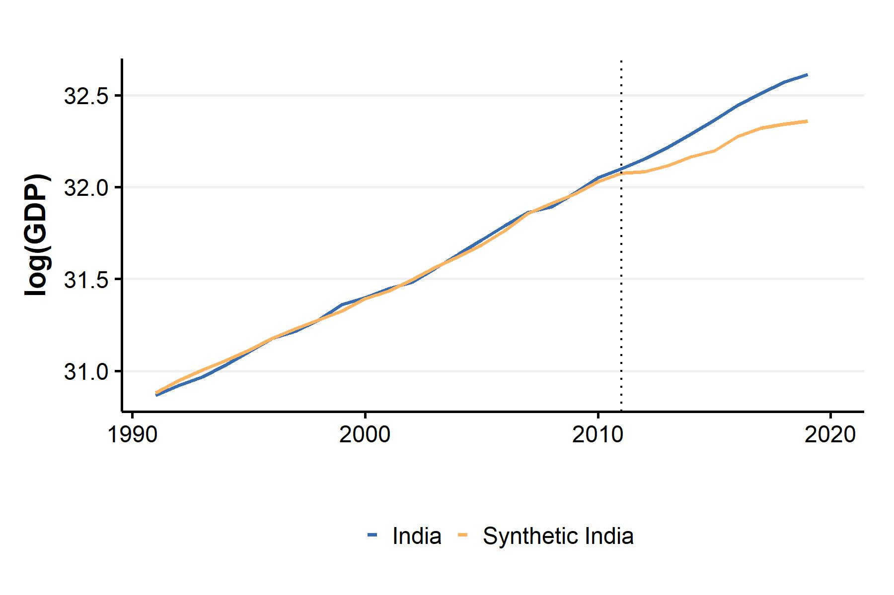
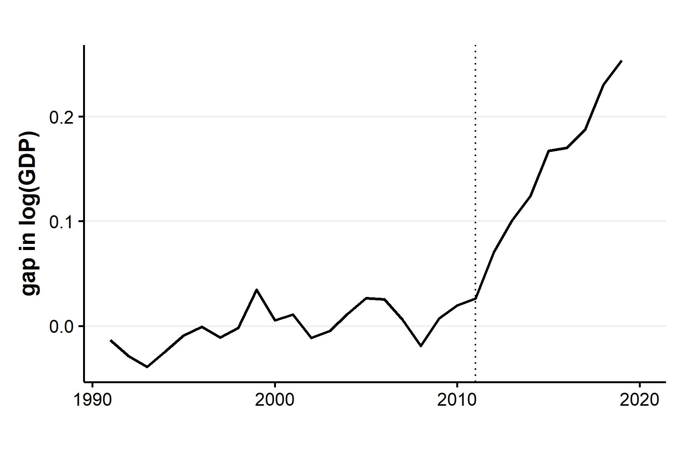
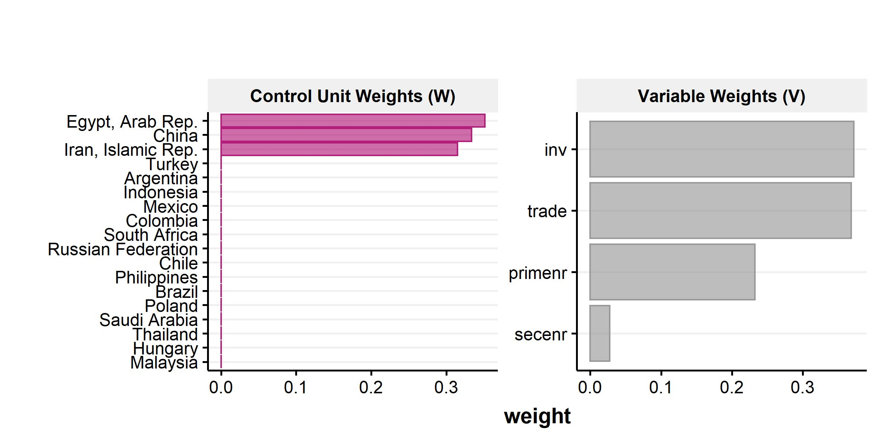
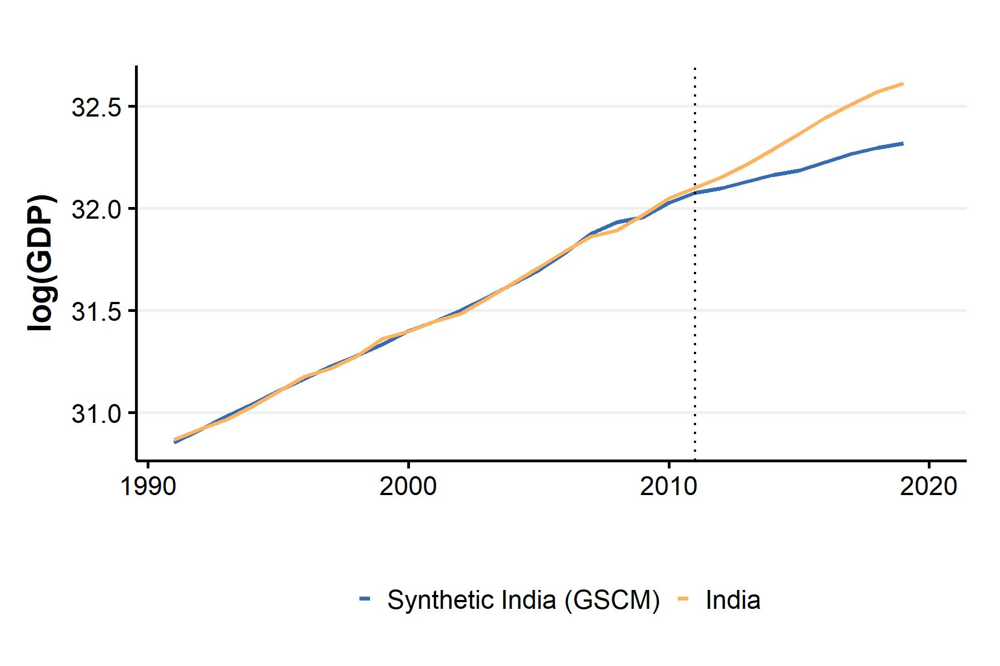
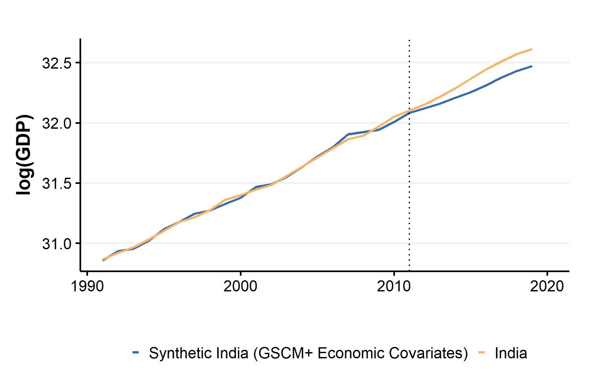
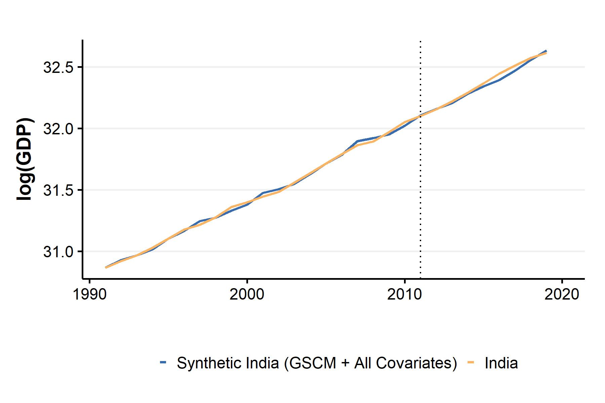
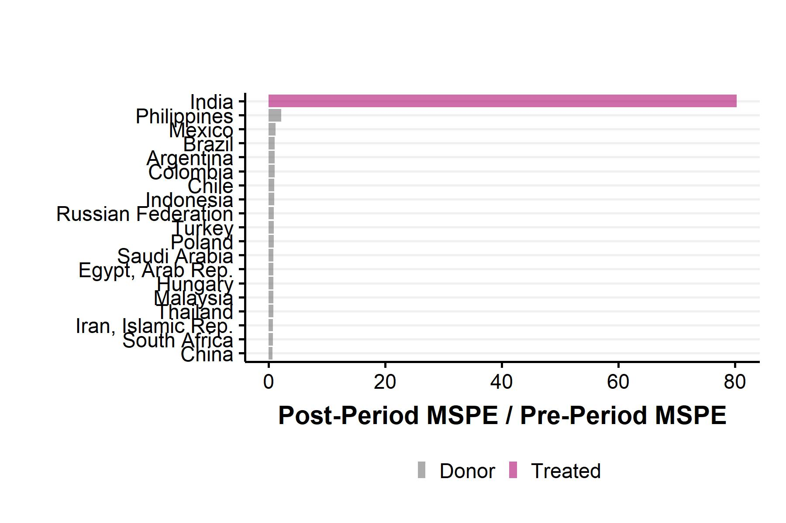
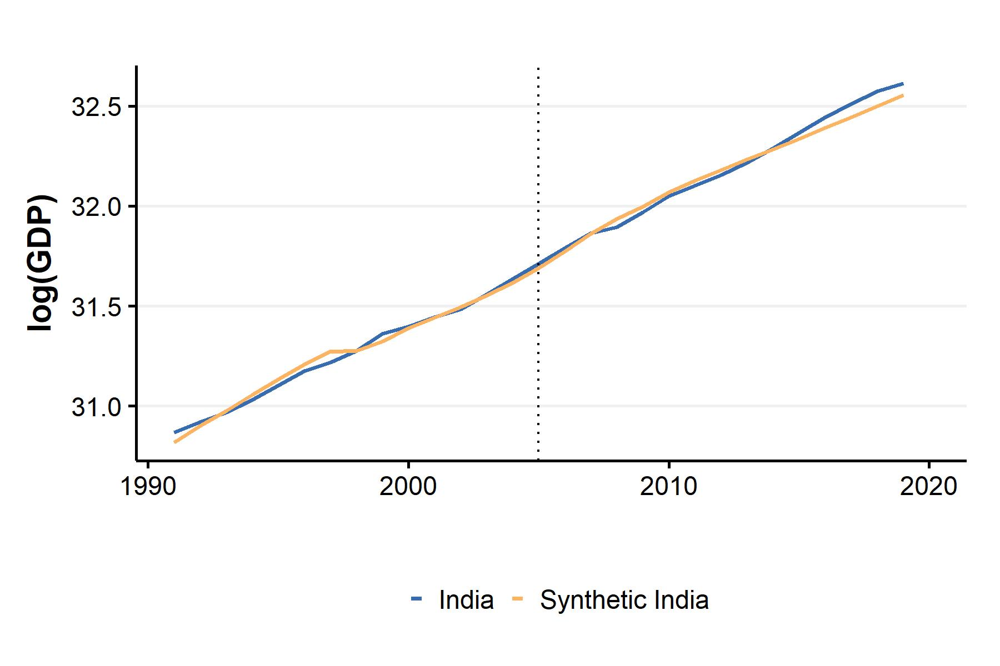
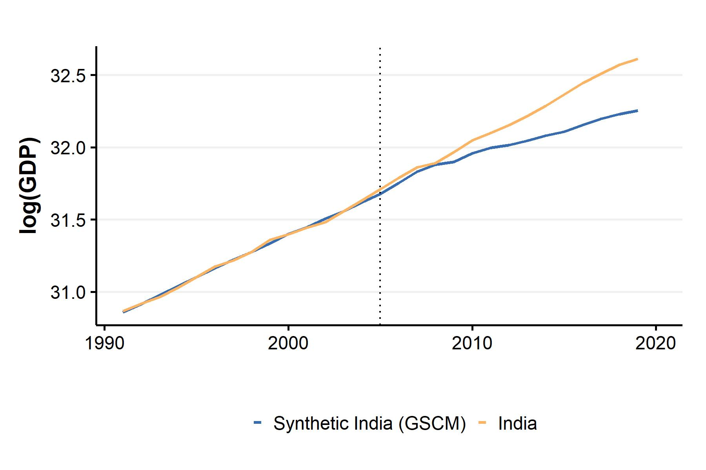
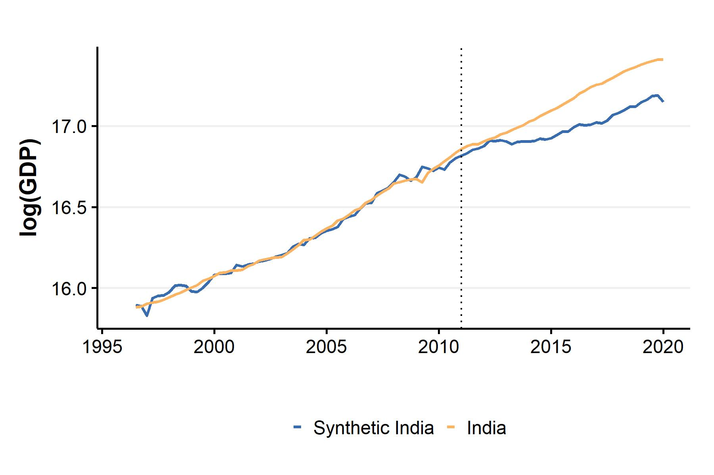

```{r, echo=FALSE}
library(thesisdown)
library(dplyr)
library(ggplot2)
library(knitr)
library(tidyselect)
```

# Estimating measurement error in India's GDP using SCM

Chapter - 1 introduced the issue of measurement error in GDP estimation, focusing specifically on the debate in India. Lack of income - side estimates, and methodological opacity make it difficult to assess the extent to which India's GDP is over/under estimated. Experts are forced to rely on sector - specific anomalies or rely on contradictions observed in fast - moving sectoral data, making it difficult to make causal claims about aggregate data. The key difficulty, in summary, is to estimate a counter factual GDP series.
\linebreak

The synthetic control method offers to be a promising alternative in this regard. Chapter - 2 establishes the SCM to be a popular tool to find the causal effect of a policy/intervention on a large unit like a country, state or city. A clean research design, backed with minimal data is sufficient to construct a plausible counterfactual, making its usage attractive for the Indian case, where quality data is scarce. 
\linebreak

In this chapter, I use the synthetic control method and the generalied synthetic control method to construct a counterfactual series for India's GDP. The synthetic control is constructed using a donor pool of countries similar to India - in this case, a set of emerging market economies as defined by the IMF. The treatment occurs at the year 2011, when the base year of the GDP series was changed from 2004-05 to 2011 - 12, along with the change in methodology of measurement. I find that XXX,
\linebreak

The rest of this chapter is structured as follows. Section 3.1 presents a brief overview of the literature on measurement error in GDP, and application to synthetic control for GDP. Section 3.2 specifieis the econometric methodology and discusses the data and the sources. Section 3.3 presents the key results, and Section 3.4 consists of robustness checks. The final section discusses the findings, their implications and concludes.

## Literature Review

Measurement error in macroeconomic data and GDP in particular has been studied extensively. In recent times, scholars have focused on improving measurement. Two strands of literature have emerged: the "forecast" error approach examines the difference between forecasted or revised estimates and actual GDP, and characterizes, whether revisions represent measurement errors or "noise", or an efficient forecast accounting for all relavant information , or "news" [@mankiw_are_1984;@mankiw_news_1986;@aruoba_improving_2013]. The second strand, which I focus on, looks at the differences between the income - method and expenditure - method estimates of GDP, as described in Chapter - 1. Since both quantities are estimates of the same unobservable (actual output), the gap between the two is only due to a measurement error.  @aruoba_improving_2016 show that information from *both* estimates can be used to optimally extract the true GDP. By treating both estimates as noisy, and using Bayesian estimation with multiple types of measurement error models, they construct a third estimate, which diagnostic tests show as being broadly representative. @jacobs_can_2022 uses a similar framework, but incorporates multiple revised estimates of noisy data, instead of a single vintage. The authors show that their estimates are less likely to undergo revisions compared to @aruoba_improving_2016. Their estimates also puts more weight on expenditure - side data, which is more readily available, and whose historical decompositions shows a larger share of "news" relative to the income - side estimates. @chang_measurement_2018 take a different approach, by using a pre - analysis plan to estimate effect of measurement error on the results of empirical papers in top journals. The authors find that replacing GDP with its revised versions does not change the key results, but using GDI instead changes the results substantially. Overall, the existing literature highlights the importance of reconciliation between various sources and releases of GDP estimates.
\linebreak

The SCM and its various offshoots have been applied extensively to estimate counterfactual GDP. @abadie_economic_2003 study the impact of terrorism in the 1960s on the per - capita GDP in the Basque County. The paper finds that there was a 10% decline in growth relative to the synthetic control not affected by terrorism. @abadie_comparative_2015 examine the impact of the German re - unification in 1990 on West Germany's per capita GDP, and find a negative effect relative to synthetic West Germany. @billmeier_assessing_2013 looks at the impact of economic liberalization on a number of Latin American, Asian and Sfrican coutnries' real GDP, and find that while the impact was positive for most, there was no significant impact from the later liberalization episodes, especially those is Africa. Most of these studies focus on GDP of European countries, with papers on developing economies being much more scarce.
\linebreak

@mayberry_economic_2022 examines the effect of the Nuclear Weapons Development programme on Pakistan's GDP, and finds that per capita GDP would have been higher by $718 on average, had the pogramme not been implemented. @singhal_economic_2016 study the impact of counterinsurgency programs to the Naxalite (Maoist) movement and find that implementing the same in one state led to a significant rise in its per capita Net State Domestic Product, relative to a synthetic control of other states where such policies were not implemented. This study differs from the existing literature in two ways: one, to my knowledge this is the first paper implementing the SCM to construct a counter factual aggregate GDP series for India. Second, this study is also the first to use the SCM to study the impact of the base year policy change on GDP, which differentiates it from the studies carried out so far, which look at GDP revisions and sectoral data (see Chapter -1 for a detailed survey).

## Econometric Approach


## Data

In this section, I introduce the data used for the construction of the synthetic control and describe the sources. The synthetic control consists of countries similar to India, without the treatment. I choose 19 countries from the International Monetary Fund's(IMF) World Economic Outlook List of Emerging Market Economies (EMEs). A country is classified as an EME if it demonstrates strong and stable growth, production of high value - added growth, and increased integration in global trade and financial markets. The following countries (other than India) were classified as being EMEs over the period 2010 - 2020: Argentina, Brazil, Chile, China, Colombia, Egypt, Hungary, Indonesia, Iran, Malaysia, Mexico, the Phillipines, Poland, Russia, Saudi Arabia, South Africa,  Thailand and Turkey.
\linebreak

The dataset consists of 551 observations over the period 1991 - 2019. The outcome variable of interest is log real GDP in local currency units (LCU). Following the literature on growth and applications of synthetic controls to GDP [@billmeier_assessing_2013;@acemoglu_democracy_2019], I include the following covariates: Gross Investment as a share of GDP, trade (sum of exports and imports) as a share of GDP, Gross Primary School Enrollment and Gross Secondary School Enrollment. The data for all variables is obtained from the World Development Indicators (WDI) database maintained by the World Bank.
\linebreak


\begin{table}[!htbp] \centering 
  \caption{ Summary Statistics} 
  \label{} 
\begin{tabular}{@{\extracolsep{5pt}}lccccc} 
\\[-1.8ex]\hline 
\hline \\[-1.8ex] 
Variable & \multicolumn{1}{c}{N} & \multicolumn{1}{c}{Mean} & \multicolumn{1}{c}{St. Dev.} & \multicolumn{1}{c}{Min} & \multicolumn{1}{c}{Max} \\ 
\hline \\[-1.8ex] 
GDP (log) & 551 & 30.0 & 2.7 & 26.0 & 37.0 \\ 
Investment & 538 & 23.0 & 6.4 & 12.0 & 44.0 \\ 
Trade & 547 & 64.0 & 39.0 & 14.0 & 220.0 \\ 
Primary Enrollment & 551 & 106.0 & 9.6 & 78.0 & 166.0 \\ 
Secondry Enrollment & 551 & 83.0 & 17.0 & 30.0 & 121.0 \\ 
\hline \\[-1.8ex] 
\end{tabular} 
\end{table}

Table 3.1 shows the summary statistics for the outcome variable as well as the predictors. The average log GDP is 30, while the average investment and trade ratios are 23% and 64% respectively. There is large variance in the trade ratio data, as the dataset includes countries which rely heavily on trade like Saudi Arabia, as well as relatively closed economies like Argentina. The Gross Primary Enrollment Ratio which is the total enrollment divided by the population of relevant age group is above 100 at the mean, which happens due to inclusion of over-aged and under- aged students, as well as grade repetition. The Seconary Enrollment Ratio measures the same, but for the secondary school age group.
\linebreak


Observations for GDP are available for all years, and trade and investment for most years. There were significant amount of missing values (between 80 - 100), for the two enrollment ratios. However, as the gaps were not longer than a few years, and data was not missing for a significant chunk of the time period for any country, the missing values were filled via linear interpolation.
\linebreak

The data was extracted using the `R` package `wdi`, while the SC and GSCM was implemented using the packages `tidysynth` and `gsynth` respectively.

## Results

I begin by presenting the counterfactual GDP estimates first using the SCM, and then the GSCM.


```{r indsyn, echo=FALSE, fig.align="center",out.width="100%", fig.cap="Evolution of Log GDP for India and Synthetic India (SCM)"}

```

Figure \@ref(fig:indsyn) shows the trend of log GDP for India and the estimated counter factual over the period 1991 - 2019. The counter factual tracks the actual log GDP trend very closely pre - 2011, and starts diverging from the actual trend post - 2011. Given the assumptions of the SCM, the synthetic control is representative of how India's GDP would have evolved in the absence of the change in measurement methodology.

```{r indsyngap, echo=FALSE, fig.align="center",out.width="100%", fig.cap="Log GDP gap between India and Synthetic India (SCM)"}

```

The same result is shown in a different way in Figure \@ref(fig:indsyngap). This plots the difference between the log GDP trends for actual and synthetic India. As evident from Figure \@ref(fig:indiasyn), the difference remains close to zero pre - treatment, and then increases steadily post - 2011, reaching close to 0.25 log points. 
\linebreak


```{r weights, echo=FALSE, fig.align="center",out.width="100%", fig.cap="Variable weights and country weights for synthetic India"}

```


Which countries is synthetic India composed of? Figure \@ref(fig:weights) shows the optimal country weights, as well as the weights assigned to each predictor. From the left panel, it is clear that synthetic India is composed of Egypt, China and Iran, with each contributing about one -thirds to the total weights. The other countries contribute xlose to nothing. This sparse distribution of weights is a result of the restriction of positive weights summing to one - this prevents extrapolation, and assigns the weights such that the synthetic control lies within the convex hull. The right panel shows the contributions of the predictors: Investment and trade contribute a large share (around 70%), followed by primary enrollment. 
\linebreak

I now present the results of the counter factual estimates generated by the GSCM below. Three specifications were run: without covariates, with economic covariates (trade and investment) only, and with all covariates.


```{r indgsyn, echo=FALSE, fig.align="center", out.width="100%", fig.cap="Evolution of Log GDP for India and Synthetic India (GSCM)"}


```
\newpage


```{r indgsyngap, echo=FALSE, fig.align="center",out.width="100%", fig.cap="Log GDP gap between India and Synthetic India (GSCM)"}

```

Figures \@ref(fig:indgsyn) and \@ref(fig:indgsyngap) show the estimated counterfactual log GDP and actual GDP, and the gap between the two respectively, as measured using the GSCM. As with the SCM, the pre - intervention fit of the counter factual matches the actual trend, and then diverges post - 2011. While the two results look similar, the magnitude of the gap post treatment is different, with the difference exceeding 0.3 log points in case of the GSCM. 
\newpage
```{r indgsync1, echo=FALSE, fig.align="center",out.width="100%", fig.cap="Evolution of Log GDP for India and Synthetic India with economic covariates (GSCM)"}

```
```{r indgsync2, echo=FALSE, fig.align="center",out.width="100%", fig.cap="Evolution of Log GDP for India and Synthetic India with all covariates (GSCM)"}

```

Figures \@ref(fig:indgsync1) and \@ref(fig:indgsync2) show the same results as the images above, but with the inclusion of economic and all covariates respectively. In the first case, the gap post -treatment persists, but at a lower magnitude (around 0.15 log points). In the second, case the post- treatment fit and the pre - treatment fit barely diverge, indicating that the treatment had no impact on India's GDP, when education covariates are included. Hence, the GSCM results are robust to the inclusion of economic covariates, but not to the additional inclusion of education predictors.
\linebreak

\newrobustcmd{\B}{\bfseries}


\begin{table}[h!!]
\centering
\begin{tabular}{rrrrr}
\hline
Year & SCM & GSCM & GSCM+EC & GSCM+AC\\
\hline
2011 & 0.63 & 0.35 & -2.52 & -3.31\\
\hline
2012 & 4.45 & 3.06 & 1.38 & -0.03\\
\hline
2013 & 3.00 & 3.00 & 2.47 & 1.58\\
\hline
2014 & 2.33 & 3.83 & 2.35 & -0.31\\
\hline
2015 & 4.34 & 5.38 & 2.96 & 1.54\\
\hline
2016 & 0.27 & 3.79 & 2.26 & 2.90\\
\hline
2017 & 1.73 & 2.51 & 0.18 & -1.23\\
\hline
2018 & 4.29 & 3.45 & 0.89 & -2.32\\
\hline
2019 & 2.35 & 1.93 & -0.25 & -3.72\\
\hline
\B Avg. & \B 2.6 & \B 3.0 & \B 1.1& \B -0.5\\
\hline
\end{tabular}
\caption{Difference between growth rates (percentage) of actual and synthetic GDP (All specifications)}
\end{table}

Table 3.2 shows the difference between the actual and synthetic GDP growth rates for the period 2011 - 2019. The first column shows the growth gap for results estimated using the SCM: except for the year 2016, the difference in growth has exceeded 1.5% for every year, yielding an average gap of 2.6% over the whole period. The magnitude is larger for the GSCM estimates without covariates, shown in the second column. Post 2011, the gap has consistently been above 3%, even crossing 5% in 2015. The average growth gap in this period broadly matches the findings of @subramanian_indias_2019. The inclusion of economic covariates does reduce the average growth gap to 1.1%, but this is largely due to the period 2017 - 2019; from 2012 - 2017, the average gap exceeded 2%. The inclusion of education covariates, leads to a significant fluctuation in the growth gap, as seen in the last column. With the gap varying between 2.9% to -3.7% over this period, the average growth gap of -0.5% suggests that there was no significant difference between actual and synthetic India's GDP growth rates.

### Inference

The last section presented the results of the estimated counterfactual GDP using two synthetic control techniques. How significant are these findings?  In this section, I present the results of the various inference tests used to assess the credibility of the results obtained using the SCM and the GSCM.
\linebreak

As discussed in Chapter - 2, Fisher's exact p -values to evaluate the probability of getting the same result had the treatment been randomly assigned to some other country, instead of India. Table - 3.3 presents the p - values below.

\begin{table}[h!!]
\centering
\begin{tabular}{rrr}
\hline
Country& Type & p - value\\
\hline
India & Treated & \B 0.053\\
\hline
Philippines & Donor & 0.105\\
\hline
Mexico & Donor & 0.158\\
\hline
Brazil & Donor & 0.211\\
\hline
Argentina & Donor & 0.263\\
\hline
Colombia & Donor & 0.316\\
\hline
Chile & Donor & 0.368\\
\hline
Indonesia & Donor & 0.421\\
\hline
Russian Federation & Donor & 0.474\\
\hline
Turkey & Donor & 0.526\\
\hline
\end{tabular}
\caption{Fisher's exact p - values}
\end{table}

The p - value for India is 0.053, indicating that there is a 5.3% probability of getting the same results as those for India. However, the size of the p - value has a lower bound by construction, as it is simply a function of the number of donor units, in this case 1/19. This makes it a unreliably metric for inference.
\newpage
```{r msper, echo=FALSE, fig.align="center",out.width="100%", fig.cap="Ratio of post and pre - treatment MSPE for India and donor countries"}

```

Figure \@ref(fig:msper) shows the ratio of post period and pre - period MSPE. The MSPE is a measure of how close the fit between the actual outcome variable and the synthetic control is. The figure shows the ratio of the MSPE calculated post 2011 and pre 2011 for all donor countries as well as India, serving as a placebo test. The ratio is much higher for India than for the donor pool, indicating that the post treatment fit deviates significantly from the pre - treatment fit to a much larger magnitude relative to other countries. While this is a good starting point to establish the credibility of the synthetic control, it is not a sampling - based statistical test (like a t - test). In the case of the SCM, this is difficult to implement due to absence of a well defined sampling mechanism. Hence, additional robustness tests are required, which are discussed in the next section.

\begin{table}[h!!]
\centering
\begin{tabular}{cccc}
\hline
Model & Average ATT & Std. Err. & p - value\\
\hline
Baseline GSCM&0.166& 0.256 & 0.516\\
\hline
GSCM with economic covariates & 0.094 & 0.139 & 0.499\\
\hline
GSCM with all covariates & 0.013 & 0.154 & 0.928\\
\hline
\end{tabular}
\caption{ Average ATT and p - values for GSCM specifications}
\end{table}

Table 3.4 shows the average Average Treatment Effect on the Treated, which is simply the mean of the difference between the actual and counterfactual log GDP estimated via GSCM, and the associated p -values. It is important to note that the p - values are calculated in a completely different way from the SCM: rather than a permutation test, uncertainty bounds and variance is estimated using a parametric bootstrap (for details, see Chapter - 2). The results indicate that the mean ATT magnitude falls with the inclusion of covariates and that none of the specifications yield statistically significant results.
\linebreak

The lack of significant results could be due to two reasons: one, while the GSCM does allow the inclusion of co -variates with an incomplete panel, the dropping of observations reduces sample size by 50, which is 10% of the sample. Reduced sample size due to sparse covariate data affects the unbiasedness of the GSCM estimator significantly. Second, @xu_generalized_2017 cautions against a straightforward interpretation of results when the number of donor units is less than 40. Since I use only 19 donor countries, the results are prone to bias. 


## Robustness Checks

I implement two robustness checks:

**Backdating**: The treatment is assigned a few years/quarters prior to the actual intervention, and the SCM and GSCM are estimated with the new pre and post treatment periods. The results are robust if:

a. The pre - treatment fit does not change between the new and old treatment year, indicating the absence of any anticipation effect.

b. The gap between the synthetic and actual outcome variable of interest starts around the same time as the actual treatment.
\linebreak

I implement the SCM and GSCM by backdating the treatment to the year 2005. This year is chosen so as to allow sufficient pre - intervention time periods (15 years), as atleast 10 years is the minimum recommended for effective implementation of the GSCM.

\newpage 

```{r scmbd, echo=FALSE, fig.align="center",out.width="100%", fig.cap="Evolution of log GDP for actual and synthetic India with backdated treatment (SCM)"}

```

Figure \@ref(fig:scmbd) shows the results of backdating implemented using the SCM. Between 2005 and 2011, the synthetic India line closely tracks the actual India line, meeting the first criterion, and ruling out anticipation effects. However, this pattern continues post -  2011 as well, and the first signs of divergence appear only near 2016, five years after the actual treatment, which raises concerns about the credibility of the SCM estimates.
\newpage
```{r gscmbd, echo=FALSE, fig.align="center",out.width="100%", fig.cap="Evolution of log GDP for actual and synthetic India with backdated treatment (GSCM)"}

```
Figure \@ref(fig:gscmbd) shows the results of backdating implemented using the GSCM. As previously, there is no gap between the two lines for the period 2005 - 2011. However, the two trends begin to diverge around the actual treatment year, satisfying both conditions for robustness. The backdating procedure indicates that the GSCM estimates are robust relative to SCM.
\linebreak

**Quarterly data**: This robustness check replaces yearly data with quarterly data for the outcome variable. This provides a more granular measure of the GDP, and significantly increases number of observations, attenuating the bias of both estimators. I implement this only for the GSCM, as the SCM requires data for predictors, which was not available on a quarterly basis.
\linebreak

The data for quarterly real GDP is taken from the International Monetary Fund's (IMF) International Financial Statistics (IFS) database. The same donor countries were used. The time period is from 1996 Q2 to 2019 Q4, yielding a dataset of 1147 observations.

```{r gqtr, echo=FALSE, fig.align="center",out.width="100%", fig.cap="Evolution of log GDP for actual and synthetic India with quarterly data (GSCM)"}

```
Figure \@ref(fig:gqtr) shows the results of the above robustness test estimated using the GSCM. The pre - treatment fit remains good prior to 2011. The divergence begins not immediately at 2011 Q1, but almost a year later. However, the overall patterns evolve similar to the SCM and Baseline GSCM results, confirming the robustness of the GSCM results to the use of quarterly data.
\linebreak

## Discussion and Conclusion

In this chapter, I use the SCM and GSCM to estimate a counterfactual trajectory of India's real GDP. In doing so, I attempt to quantify the extent of conjectured GDP overestimation post - 2011. The SCM results suggest that real GDP growth has been over estimated by 2.6% on average since the change in base year. However, these results are sensitive to specification, and not fully robust to backdating. The GSCM results, with and without covariates imply that the over-estimation has been between -0.5% and 3% on average. The baseline GSCM results are robust to backdating and usage of quarterly data, but statistically insignificant, as are the results with covariates.
\linebreak

As discussed before, both the SCM and GSCM perform poorly with low sample size, which is the case in the specifications with predictors, as a number of observations are missing for many countries. Furthermore, a caveat to keep in mind while interpreting these results is that inference for synthetic control and its class of models is an evolving enterprise, and that any results, significant or otherwise need to be interpreted with caution.
\linebreak

With regards to the two issues mentioned above, multiple promising avenues have opened up, which serve as a natural extension to this project. The first pertains to development of methods of conformal inference, and exact t - tests by Victor Chernozhukov and co - authors [@chernozhukov_exact_2021;@chernozhukov_t-test_2021]. As these methods of inference apply to a large class of causal models, their application to generate uncertainty bounds for SCM results seems like a feasible next step. The second avenue is the development of matrix completion methods for causal models [@athey_matrix_2021], which uses observed control outcome data to impute missing data. Finally, the synthetic difference - in - difference method, which combines the two namesake techniques [@arkhangelsky_synthetic_2021] is shown to be more efficient and unbiased relative to both individual methods. The applications of these three novelties form the basis for future research projects regadrding applying the SCM to GDP data.


